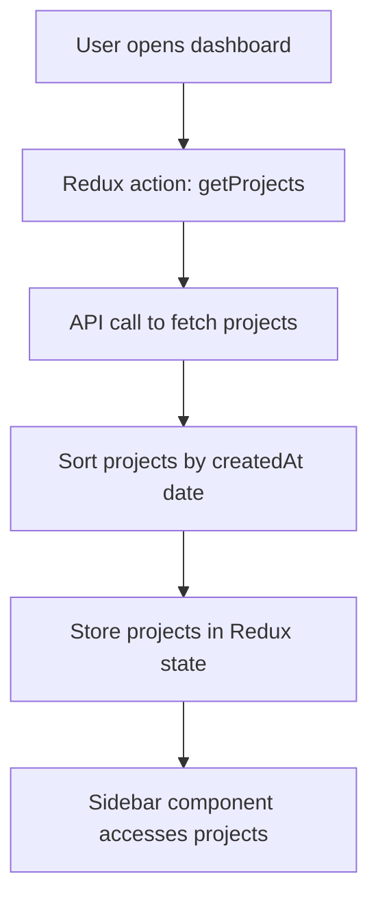
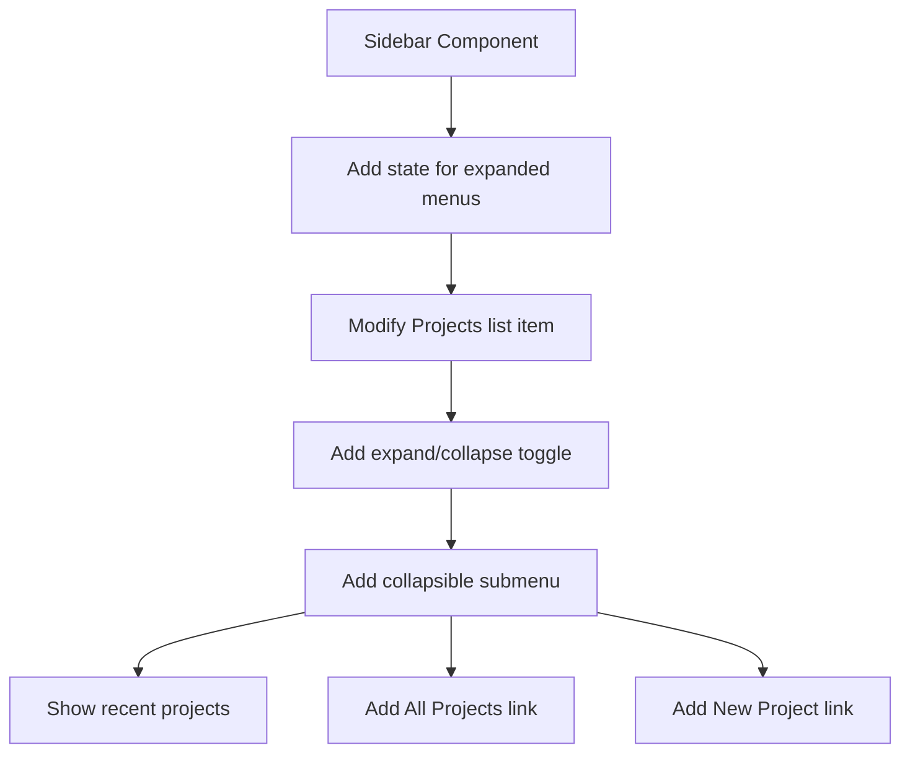
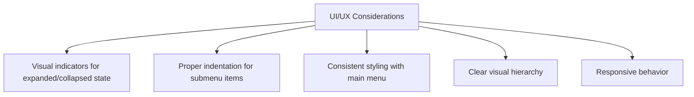

# Implementation Plan: Enhanced Sidebar with Collapsible Project Submenu

## Overview

We'll modify the existing sidebar to add a collapsible submenu under the "Projects" item. When expanded, this submenu will show:
1. The 5 most recently created projects
2. An "All Projects" link
3. A "New Project" link

## Technical Implementation Plan

### 1. Update the Redux Store

First, we need to ensure the Redux store has the necessary data for recent projects. The current implementation already fetches all projects, but we need to ensure they're properly sorted by creation date.



### 2. Modify the Sidebar Component

We'll need to update the Sidebar.js component to support collapsible submenus:



#### Implementation Details:

1. Add state to track which menu items are expanded
2. Add a toggle button to the Projects list item
3. Create a collapsible submenu component
4. Render recent projects in the submenu
5. Add "All Projects" and "New Project" links

### 3. UI/UX Considerations



### 4. Testing Strategy

We'll need to test:
1. Proper expansion/collapse of the submenu
2. Correct sorting of recent projects
3. Navigation to project pages
4. Responsive behavior on different screen sizes

## File Changes Required

1. **dashboard/client/src/components/layout/Sidebar.js**
   - Add state for expanded menus
   - Modify the Projects list item to include a toggle
   - Add the collapsible submenu component
   - Implement the logic to show recent projects

2. **dashboard/client/src/redux/slices/projectSlice.js**
   - Ensure projects are sorted by creation date
   - Add a selector for recent projects

3. **dashboard/client/src/components/layout/Layout.js** (potentially)
   - Adjust layout to accommodate the expanded submenu

## Detailed Component Structure

### Updated Sidebar Component

```jsx
// Simplified pseudocode
const Sidebar = ({ open, toggleSidebar }) => {
  const [expandedItems, setExpandedItems] = useState({
    projects: false
  });
  
  const { projects } = useSelector(state => state.projects);
  
  // Get 5 most recent projects by creation date
  const recentProjects = useMemo(() => {
    return [...projects]
      .sort((a, b) => new Date(b.createdAt) - new Date(a.createdAt))
      .slice(0, 5);
  }, [projects]);
  
  const toggleExpanded = (item) => {
    setExpandedItems(prev => ({
      ...prev,
      [item]: !prev[item]
    }));
  };
  
  return (
    <Drawer>
      <List>
        {/* Dashboard item */}
        
        {/* Projects item with submenu */}
        <ListItem>
          <ListItemButton onClick={() => toggleExpanded('projects')}>
            <ListItemIcon><ProjectsIcon /></ListItemIcon>
            <ListItemText primary="Projects" />
            {expandedItems.projects ? <ExpandLessIcon /> : <ExpandMoreIcon />}
          </ListItemButton>
        </ListItem>
        
        {/* Collapsible submenu */}
        <Collapse in={expandedItems.projects}>
          <List component="div" disablePadding>
            {/* Recent projects */}
            {recentProjects.map(project => (
              <ListItem key={project._id} sx={{ pl: 4 }}>
                <ListItemButton component={Link} to={`/projects/${project._id}`}>
                  <ListItemText primary={project.name} />
                </ListItemButton>
              </ListItem>
            ))}
            
            {/* All Projects link */}
            <ListItem sx={{ pl: 4 }}>
              <ListItemButton component={Link} to="/projects">
                <ListItemText primary="All Projects" />
              </ListItemButton>
            </ListItem>
            
            {/* New Project link */}
            <ListItem sx={{ pl: 4 }}>
              <ListItemButton component={Link} to="/projects/new">
                <ListItemText primary="New Project" />
              </ListItemButton>
            </ListItem>
          </List>
        </Collapse>
        
        {/* Other menu items */}
      </List>
    </Drawer>
  );
};
```

## Implementation Steps

1. **Update the Sidebar Component**:
   - Add state for tracking expanded menu items
   - Implement the toggle functionality
   - Create the collapsible submenu
   - Add the recent projects list
   - Add "All Projects" and "New Project" links

2. **Test the Implementation**:
   - Verify that the submenu expands and collapses correctly
   - Verify that recent projects are displayed in the correct order
   - Test navigation to project pages
   - Test responsive behavior

3. **Refine the UI**:
   - Adjust styling for visual hierarchy
   - Ensure consistent styling with the rest of the application
   - Add visual indicators for the expanded/collapsed state

## Potential Challenges and Solutions

1. **Challenge**: Handling long project names in the sidebar
   **Solution**: Implement text truncation with tooltips for full names

2. **Challenge**: Responsive design for smaller screens
   **Solution**: Adjust padding and possibly hide icons on very small screens

3. **Challenge**: Performance with many projects
   **Solution**: Implement memoization to prevent unnecessary re-renders

## Required Dependencies

We'll need to import the following additional components from Material UI:
- `Collapse` - For the collapsible submenu
- `ExpandLess` and `ExpandMore` icons - For the toggle indicators

## Next Steps

After implementing the enhanced sidebar with the collapsible project submenu, potential future enhancements could include:
- Adding the ability to star/favorite projects
- Implementing project categories or tags
- Adding a search function within the projects submenu