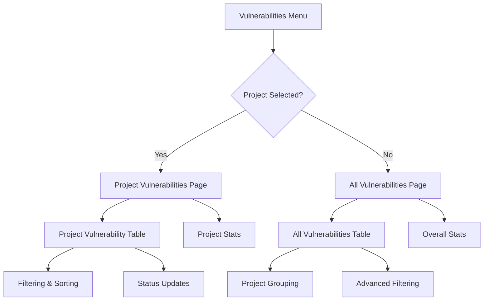
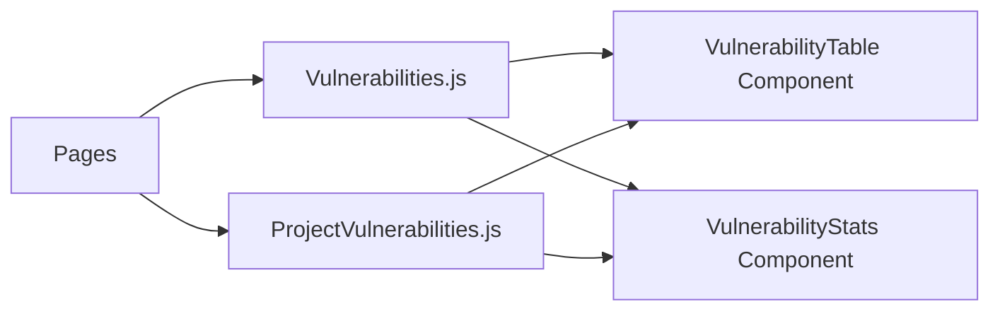
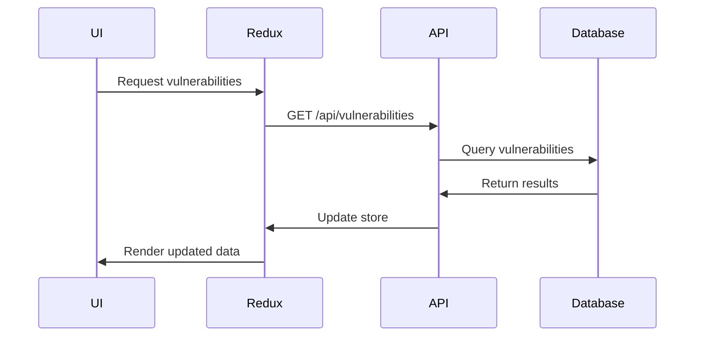

# Vulnerability Feature Implementation Plan

## Overview
Implementation plan for the Vulnerabilities menu in the sidebar, supporting both all-project and project-specific vulnerability views.

## Architecture

### Page Flow


### Component Structure


## Implementation Details

### 1. Component Structure
```
components/
  vulnerabilities/
    VulnerabilityTable.js       # Reusable table component
    VulnerabilityStats.js       # Stats display component
    VulnerabilityFilters.js     # Filtering controls
    VulnerabilityStatusBadge.js # Status indicator
```

### 2. Routing Structure
```
/vulnerabilities              # All vulnerabilities
/vulnerabilities/:projectId   # Project-specific vulnerabilities
```

### 3. Table Features
- Columns:
  - Severity
  - Category
  - Status
  - Project
  - Description
  - Found Date
- Functionality:
  - Filtering by severity, category, status
  - Sorting by any column
  - Pagination
  - Status updates with user assignment
  - Stats view for severity/category distribution
  - Export capability

### 4. Data Flow


### 5. Required Updates

#### Backend
- Add new API endpoint for all vulnerabilities
- Update vulnerability model with additional fields
- Implement filtering and pagination
- Add new aggregation queries for stats

#### Frontend
- Add new Redux actions and selectors
- Create new route components
- Update sidebar navigation logic
- Implement filtering and sorting utilities

### 6. Redux Integration
- New actions:
  - `getAllVulnerabilities`
  - `getFilteredVulnerabilities`
  - `updateVulnerabilityFilters`
- Selectors:
  - `selectFilteredVulnerabilities`
  - `selectVulnerabilityStats`
  - `selectVulnerabilityFilters`

## Implementation Phases

1. **Backend Updates**
   - Create new API endpoints
   - Update models
   - Implement filtering logic

2. **Core Components**
   - Create base components
   - Implement routing structure
   - Set up Redux integration

3. **Table Implementation**
   - Build reusable table component
   - Implement sorting and filtering
   - Add pagination

4. **Statistics and Visualization**
   - Implement stats components
   - Add data visualization
   - Create export functionality

5. **Testing and Refinement**
   - Unit tests for new components
   - Integration tests for API endpoints
   - Performance optimization
   - UI/UX refinements